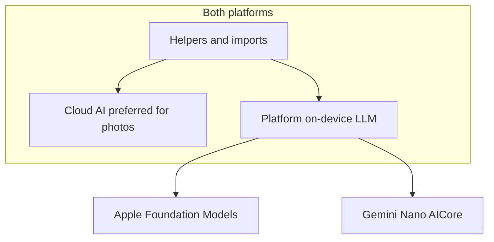

# Android release preparation (updated)

## Goal

Ship on **Google Play** with the **same product story as iOS**: privacy-first ledger on device, optional **on-device AI** for helpers and PDF/text import fallback, optional **Cloud AI** for photos and when on-device is unavailable.

## Current Play Console status

- **Not yet in production** — internal/open testing track is set up; test link shared for an earlier build
- **Android device needed** to finish: on-device AI (AICore/Gemini Nano), IAP license testing, final smoke test, store listing screenshots
- Production listing + `NEXT_PUBLIC_ANDROID_APP_URL` when ready to go public

## On-device AI parity

| Capability | iOS | Android (target) |
|------------|-----|------------------|
| Helpers (Home, Ledger, Context, Goals ✨) | Apple Foundation Models | **Gemini Nano via AICore** |
| PDF/text import fallback | On-device | On-device when AICore available |
| Photo import | Cloud AI | Cloud AI |
| Onboarding expense note | Apple on-device | Gemini Nano when available |
| Demo ledger customization | Apple on-device | Gemini Nano when available |

**Requirements on Android:** Supported Pixel/Samsung device, AICore system app, optional AICore beta enrollment, Developer Options → on-device GenAI enabled. Graceful fallback to Cloud AI + user API keys when unavailable.



## Implementation order

1. **Android on-device plugin** — Kotlin `GeminiNanoPlugin` + Dart channel wiring (mirror iOS API)
2. **UX + legal** — platform copy, auto-enable on-device when available, Cloud consent only when needed
3. **Build/signing** — keystore, `build_play_aab.sh`, `setup_android.sh`
4. **Play Console docs** — internal testing, IAP IDs, device smoke checklist
5. **Device verification** — user runs on physical Android when available

## Build

```bash
./scripts/generate_android_keystore.sh   # once
./scripts/build_play_aab.sh              # prod AAB
```

Package: `com.getzoro.zoroFlutter` · IAP: `com.getzoro.pro_monthly_sub`, `com.getzoro.credit_1`
