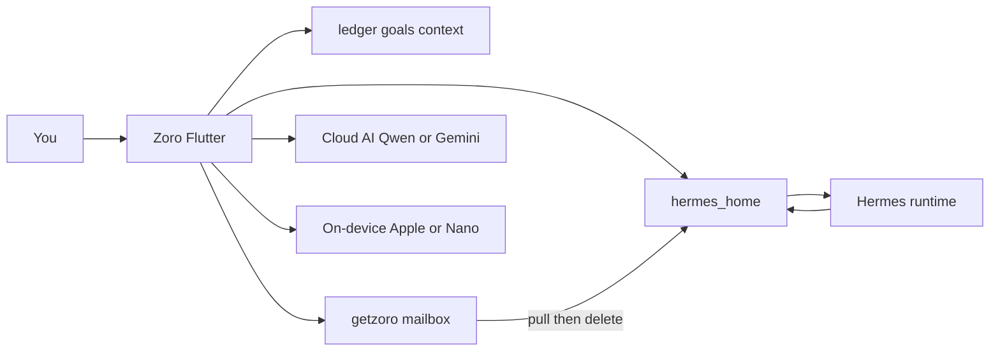

# Zoro

Privacy-first personal finance on your phone. The phone is the source of truth. There is no bank sync. Optional AI is consent-gated.

The on-device agent is **Hermes**. It lives in a local `hermes_home/` next to your ledger. Hosted site: [getzoro.com](https://www.getzoro.com).

License: [MIT](LICENSE). This is a tool for clarity, not regulated financial, tax, or investment advice.

## How Hermes chat is expected to work

You talk to Hermes on the phone. It only sees `hermes_home/` plus what the app grants (skills, inbox PDFs, living plan).



- The **living retirement plan** is versioned markdown (`hermes_home/docs/retirement.md` plus revisions). Saves never overwrite HEAD in place.
- PDFs land in `hermes_home/inbox/` — dropped on the device, or pulled from a getzoro mailbox. Statement passwords stay in the OS keychain, never in JSON.
- getzoro.com is a **brief inbound pipe**, not a second ledger. After the phone downloads and acks, the server copy is gone.
- ✨ helpers (Home, Ledger, Context, plan) can use on-device models or Cloud AI (`POST /api/mobile/assistant`). Cloud AI is Qwen/vLLM when `QWEN_*` is set, else Gemini. Pro is unlimited; Free spends a token balance.
- Hermes cron files under `hermes_home/cron/` map to local notifications (`hermes:{jobId}`). Master Off cancels those jobs too.
- Skills start empty (`.no-bundled-skills`). Packs come later; until then the plan helper still walks corpus and paydown.

**Status:** the Agent tab and on-device house exist. The native runtime is still a stub (`StubHermesAdapter`) until the real Hermes package is wired.

## What's here

| Path | Role |
|------|------|
| [`zoro_flutter/`](zoro_flutter/) | iOS/Android app (v1.0.1+13). Tabs: Home, Ledger, Context, **Agent**, Settings. Split on-device JSON, Hermes home, inbox, vault, living plan editor. |
| [`zoro-app/`](zoro-app/) | Next.js site: marketing, token-gated forms, legal, mobile APIs (assistant, entitlements, IAP, import), MCP servers, Supabase migrations. |
| [`checkin/`](checkin/) | Weekly check-in email service (Resend + inbound webhooks). |
| [`ci_scripts/`](ci_scripts/) | Xcode Cloud post-clone → Flutter iOS prepare. |

Details: [`zoro-app/README.md`](zoro-app/README.md) (env + on-device layout), [`zoro_flutter/README.md`](zoro_flutter/README.md) (run), [`zoro_flutter/TASKS.md`](zoro_flutter/TASKS.md) (ship checklist).

```bash
cd zoro_flutter && flutter pub get && flutter run --dart-define=API_BASE_URL=https://www.getzoro.com
cd zoro-app && npm install && npm run dev
```

## Work remaining

**Product**

- Wire a real Hermes runtime (replace the stub) and ship skill packs.
- Mailbox API on getzoro (`/api/mobile/mailbox/*` client exists; routes are not in `zoro-app` yet).
- Deduct Cloud AI tokens on `/api/mobile/assistant` (helpers exist; the route still returns `{ text }` only).
- Onboarding v2 (split slider + retire-date vs invest/mo).
- Store / Play smoke and listings.

**Open-source hygiene**

- Stop tracking `checkin/node_modules`, `checkin/dist`, `.DS_Store`; tighten the root `.gitignore`.
- Replace hardcoded notify emails in waitlist/lead API routes with env-only defaults; scrub lab hostnames from Cloud AI docs.
- Add `zoro-app/.env.example`; optionally `CONTRIBUTING.md` / `SECURITY.md`.
- Confirm Firebase client configs are restricted to the app IDs before the repo is public.
